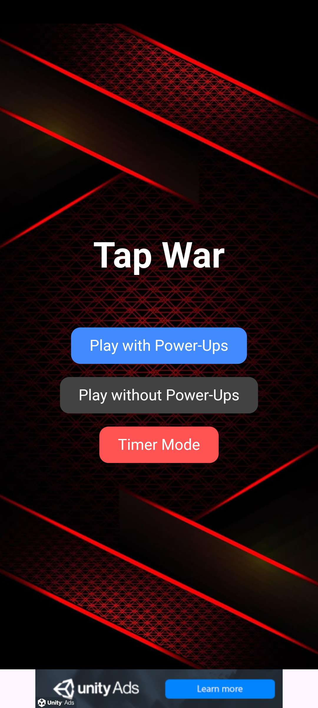
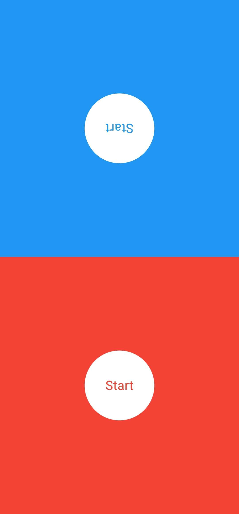
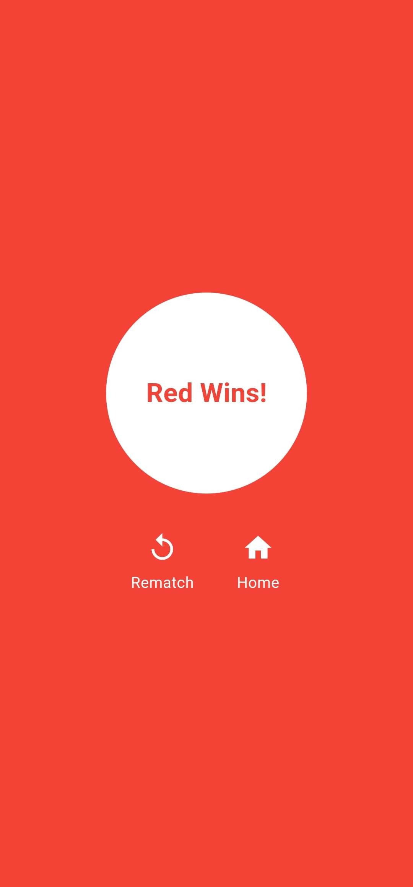

# ⚔️ Tap War

A fast-paced 2-player tap battle built with **Flutter**. Pick your mode, tap your side like crazy, and dominate your opponent using strategic power-ups!

---

## 🎮 Game Modes

- 🧨 **Normal Mode** – Features random power-ups:
  - 🛡️ Shield (block opponent taps)
  - ⚡ Boost (powerful tap advantage)
  - ✌️ Double Tap (double strength for a few hits)
- 🚫 **No Power Mode** – Just pure tapping speed. No boosts.
- ⏱️ **Timer Mode** – 20 seconds of high-stakes tapping. Winner takes all.

---

## ✨ Features

- Strategic Power-Ups & Reactive Gameplay
- Rematch with tap or a dedicated button
- Clean, minimal UI for fast play
- ⚡ Fire/spark effects on taps
- 🏆 Victory overlay with rematch + home buttons
- 💰 Unity Ads (Interstitial & Banner)

---

## 📸 Screenshots

| Home Screen | Battle | Victory Screen |
|-------------|--------|----------------|
|  |  |  |

---

## 📦 Built With

- [Flutter](https://flutter.dev)
- [Dart](https://dart.dev)
- [Unity Ads Plugin](https://pub.dev/packages/unity_ads_plugin)

---

## 🚀 Coming Soon

- Google Play release  
- Local leaderboard  
- AI bot mode (practice solo)  
- Sound effects & haptic feedback

---

## 💡 Wanna Contribute?

Pull requests welcome! Ideas? Drop an issue.  
This game was built for fun, but we’re open to evolving it with the community.

---

## ©️ License

MIT License  
Made with ❤️ by [Mohammad Yahfoufi]

